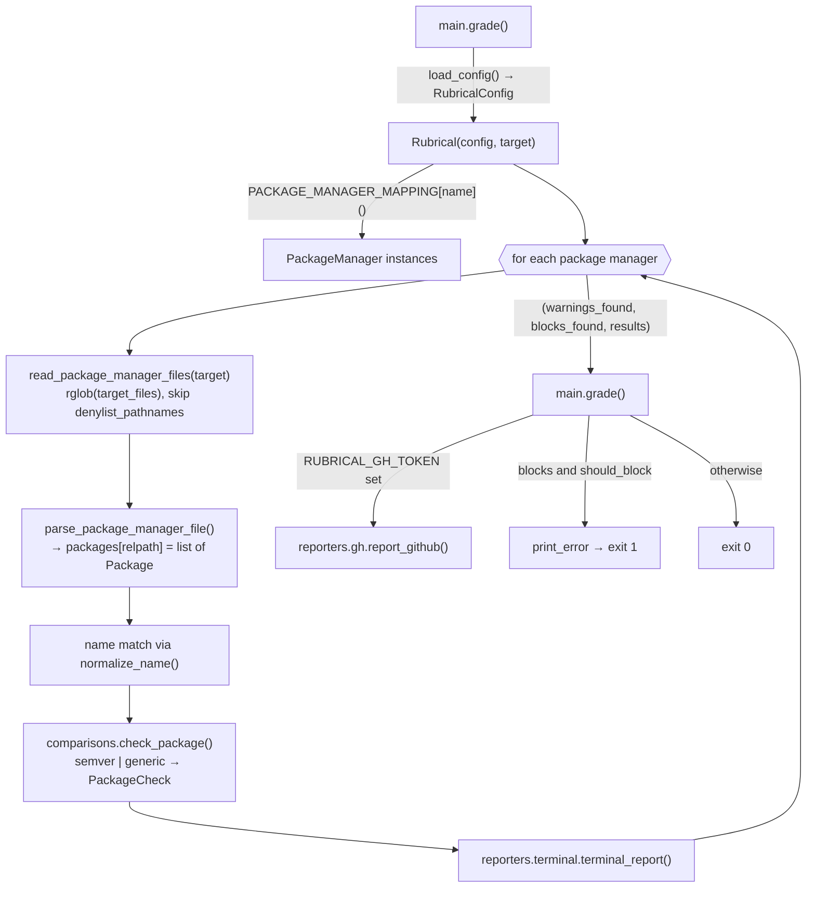

# Rubrical internals

Rubrical is a Typer CLI that scans a repository for dependency manifests, compares each declared version constraint against `warn`/`block` thresholds from a config file, and reports results to the terminal and, optionally, to a GitHub PR comment.

## Layout

| Path | Role |
|------|------|
| `rubrical/main.py` | Typer `app`. `grade` command plus the mounted `configs` sub-app. Entry point is `rubrical = rubrical.main:app`. |
| `rubrical/subcommands/configs.py` | `configs validate` and `configs jsonschema`. |
| `rubrical/rubrical.py` | `Rubrical` orchestrator and `PACKAGE_MANAGER_MAPPING` (config name → class). |
| `rubrical/package_managers/` | `BasePackageManager` ABC plus one subclass per ecosystem (`go`, `jsonnet`, `nodejs`, `python`). |
| `rubrical/comparisons/` | `check_package()` dispatches on `PackageRequirement.type` to `semversion` or `string`. |
| `rubrical/reporters/` | `terminal.py` renders a Rich table. `gh.py` upserts or deletes a PR comment through PyGithub. |
| `rubrical/schemas/` | `configuration.py` holds the Pydantic config models. `package.py` and `results.py` hold the internal dataclasses. |
| `rubrical/enum.py` | All enums: `SupportedPackageManagers`, `DependencySpecifications`, `PackageCheck`, `PackageTypes`, `SemverComparison`. |
| `rubrical/utilities/console.py` | `rich.print` wrappers. `print_error` raises `typer.Exit(1)` (typed `NoReturn`). |
| `rubrical/utilities/config.py` | `load_config(path)`, shared by `grade` and `configs validate`. Exits 1 on a `ValidationError`. |

## Flow of `rubrical grade`

## Core data model

- **Config** (Pydantic, `schemas/configuration.py`): `RubricalConfig{version, blocking_mode, package_managers[]}` → `PackageManager{name: SupportedPackageManagers, packages[]}` → `PackageRequirement{name, type=semver|generic, warn, block}`. The config is loaded from `.yaml`, `.json`, or `.toml` with `benedict`.
- **Parsed dependency** (dataclass, `schemas/package.py`): `Package{name, raw_constraint, version_constraints: [Specification{version, specifier: DependencySpecifications}]}`. A single dependency can carry several specifications, such as `>=1.0,<2`.
- **Result** (dataclass, `schemas/results.py`): `PackageCheckResult{name, file, check: PackageCheck, version_package, version_warn, version_block}`.
- `PackageCheck` has four values: `OK`, `WARN`, `BLOCK`, and `NOOP`. `NOOP` means the constraint can't be judged, for example a lower bound only.

## Package manager pattern

Each subclass of `BasePackageManager`:

1. Sets the class attributes `target_files` (glob names) and, optionally, `denylist_pathnames`, which are substring-matched against the path.
2. Sets `self.name = SupportedPackageManagers.X.value` in `__init__`.
3. Optionally extends `self.specification_symbols` with a dict merge (`|`) to map ecosystem operators. Python adds `~=`→`APPROX_EQ`. NodeJS adds `~`→`APPROX_EQ` and `^`→`COMPATIBLE`.
4. Implements `parse_package_manager_file(details)`, which must initialize and fill `self.packages[details.name]`. `details.name` is the file path relative to `--target`.
5. Optionally overrides `normalize_name(name)`. It is applied to both the config name and the parsed name before matching. The default keeps names exact; Python applies PEP 503 rules (lowercase, with runs of `-`, `_` and `.` treated as `-`).

`match_from_specification_symbols(version)` finds the specifier by substring match. The last matching group wins, so `>=` resolves to `GTE` rather than `GT`. The function then strips the operator characters. If nothing matches, the specifier defaults to `EQ`.

| Manager | Files | Parsing notes |
|---------|-------|---------------|
| `go` | `go.mod` | Regex over `( … )` blocks. Lines containing `indirect` are skipped. Every entry is `EQ`. |
| `jsonnet` | `jsonnetfile.json` | Pydantic models for the file. The name comes from `git.repository_from_url(remote)` as `owner/repo`. The version (which may be a branch) is `EQ`. |
| `python` | `requirements.txt`, `pyproject.toml` | `requirements-parser` for each line. In `pyproject.toml`, PEP 621 `project.dependencies` are re-parsed through `requirements.parse`. Poetry (`tool.poetry`) goes through `requirements_detector.find_requirements(parent_dir)`. Requirements with no version specifier are dropped. |
| `nodejs` | `package.json` (skips `node_modules`) | Reads `dependencies`, `devDependencies`, and `peerDependencies`. `X.x` becomes `APPROX_EQ`. `a - b` becomes `GTE`+`LTE`. Two-part `>=a <b` is parsed per part. `||` and other multi-part ranges are skipped. |

## Comparison semantics (`comparisons/`)

- **semver** (default): each `Specification` reduces to the highest version the constraint allows, which is then compared against the thresholds:
  - `EQ`, `LT`, and `LTE` use the version as-is.
  - `GT`, `GTE`, and `NE` give `NOOP`.
  - `APPROX_EQ` pads missing components with `999999`, so `1.2` becomes `1.2.999999`.
  - `COMPATIBLE` replaces the last component with `999999` and pads, so `6.0.1` becomes `6.0.999999`.

  A leading `v` is stripped. The result is `BLOCK` if the version is below `block`, otherwise `WARN` if it is below `warn`, otherwise `OK`. A `ValueError` from `semver` (an unparseable version) gives `OK`. For a package with several specifications, `max_status` picks the most severe in the order `BLOCK > WARN > OK > NOOP`.
- **generic**: applies only when there is exactly one `EQ` specification; anything else gives `NOOP`. It uses a plain lexicographic string comparison (`warn > version`, `block > version`).

## Reporting

- **Terminal**: one table per manager, listing only `WARN` and `BLOCK` results and printed only when there is at least one. Otherwise a single success line is printed.
- **Exit status**: `should_block` is the `--block/--no-block` flag when given, otherwise `blocking_mode` from the config (default `true`). Blocks with `should_block` exit 1. Blocks without it print a "blocking is disabled" header and exit 0.
- **GitHub**: enabled when `RUBRICAL_GH_TOKEN` is set. It also needs `RUBRICAL_REPOSITORY` and `RUBRICAL_PR_ID`, and optionally `RUBRICAL_GH_CUSTOM_URL` (which uses `<url>/api/v3`). The existing comment is found by the marker string `[Rubrical](https://github.com/ivanklee86/rubrical) Report`. If there are warnings or blocks, the comment is edited or created. If the run is clean, any old comment is deleted.

## Common changes

**Add a package manager**
1. Add a value to `SupportedPackageManagers` in `enum.py`.
2. Create `package_managers/<name>.py` that subclasses `BasePackageManager`.
3. Register the class in `PACKAGE_MANAGER_MAPPING` in `rubrical.py`.
4. Add fixtures under `tests/files/<name>/` and a test in `tests/unit/package_managers/`. Add entries to `tests/files/rubrical*.yaml` if integration coverage is wanted.

**Add a comparison type**
1. Add a value to `PackageTypes`.
2. Create a module in `comparisons/` that returns `PackageCheck`. Use `utils.results_to_status` and `utils.max_status`.
3. Add a branch for it in `comparisons/__init__.check_package`.

## Dev workflow

- Tooling is `uv` and [Task](https://taskfile.dev). The commands are:
  - `task python:install`
  - `task python:fmt`, which runs `ruff format` and `ruff check --fix`
  - `task python:lint`, which runs `ruff` and `ty check`
  - `task python:test`, which runs `pytest tests/unit tests/integration`
  - `task docs:test`, which runs `mkdocs build --strict`
- Tests use fixture repos in `tests/files/`. Unit tests instantiate a manager, then call `read_package_manager_files(path)` and `parse_package_manager_files()`, then assert on `.packages[relpath]`. Integration tests drive `main.app` through `typer.testing.CliRunner` with `--target tests/`. GitHub tests need `RUBRICAL_TEST_GITHUB_ACCESS_TOKEN`; without it they skip. They target PR #27 of `ivanklee86/rubrical`.
- The version comes from `setuptools_scm` and is written to `rubrical/_version.py`, which is untracked. The Docker image (`Dockerfile`) uses `ENTRYPOINT ["rubrical", "grade"]`.

## Known quirks

- Unparseable semver versions (such as branch names) are treated as `OK`, not `NOOP`.
- Package names are matched exactly for every manager except Python, so a capitalization difference in a Node.js, Go or Jsonnet name won't match.
