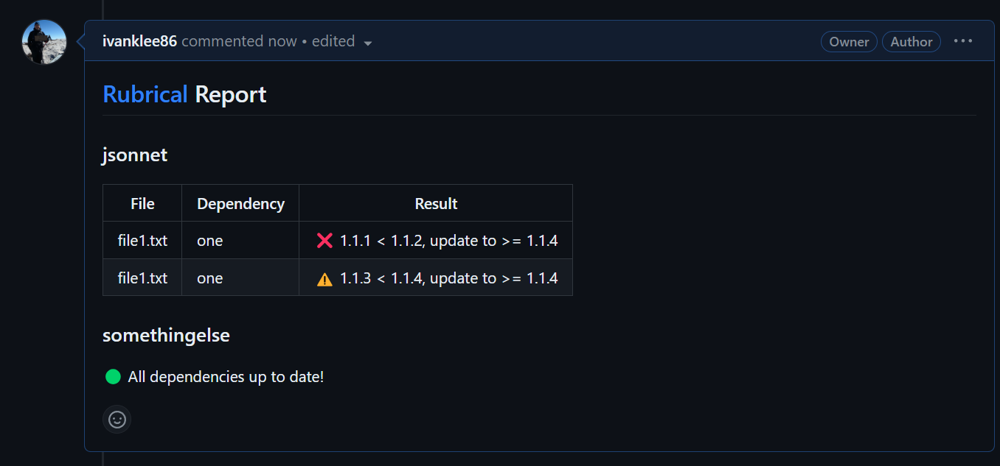

## Terminal

Comes for free!  An example can be seen below:

## Github

1. Create a Github access token with `Pull requests: Read and write` permissions to your repositories.
2. Run rubrical with the `--gh-access-token`, `--repository-name`, and `--pr-id` flags.

`rubrical` will report status on comments to the PR if violations are found.  It's also a good citizen - if no violations are found, it will clean up after itself!

